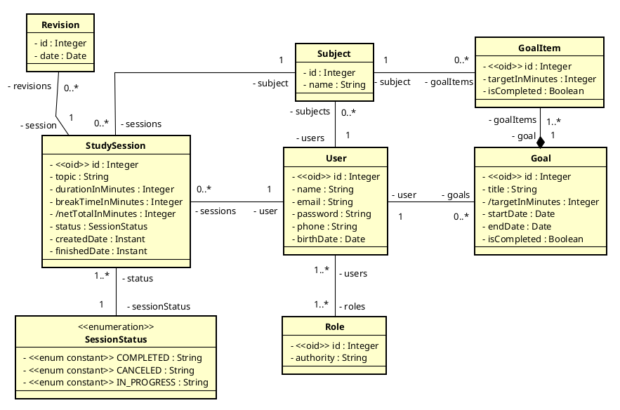
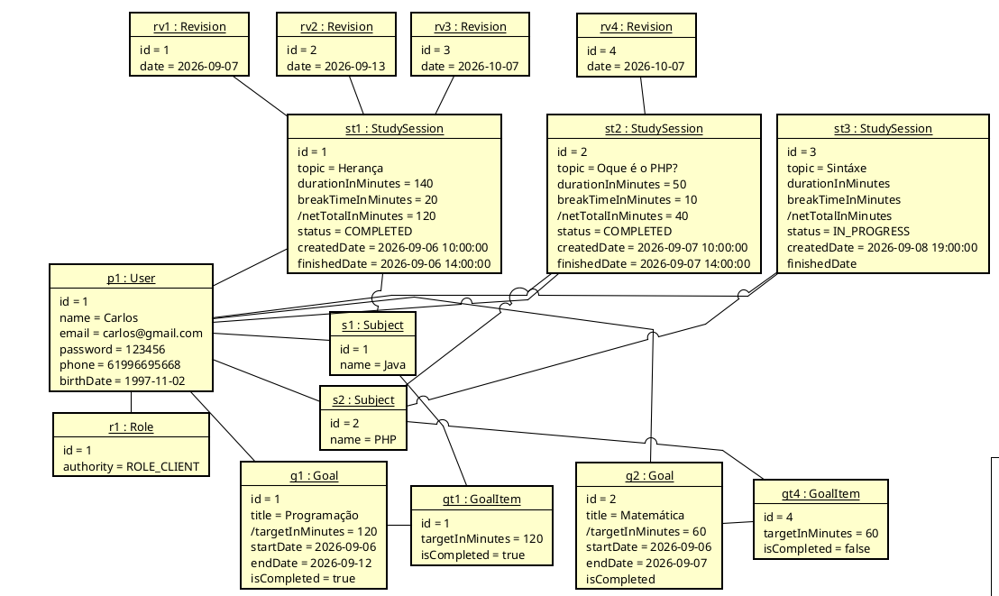

# Projeto gerenciador de estudos

API REST para gerenciamento de estudos, desenvolvida com Java e Spring Boot.

O projeto permite o gerenciamento de usuários, matérias, sessões de estudo, revisões e metas, utilizando autenticação e autorização baseada em OAuth2.

---

* [Tecnologias](#tecnologias)
* [Modelo de dados](#modelo-de-dados)
* [Diagrama de instâncias](#diagrama-de-instâncias)
* [Banco de dados e migrations](#banco-de-dados-e-migrations)
* [Autenticação](#autenticação)
* [Execução com Docker](#execução-com-docker)
* [Swagger / OpenAPI](#swagger--openapi)

---

## Modelo de dados



---

## Diagrama de instâncias



---

## Sobre o projeto

O **Study API** é uma API REST desenvolvida para auxiliar no gerenciamento de uma rotina de estudos.

Entre as principais funcionalidades estão:

* Cadastro e gerenciamento de usuários;
* Gerenciamento de matérias;
* Criação e acompanhamento de sessões de estudo;
* Controle de revisões;
* Gerenciamento de metas;
* Controle de acesso baseado em funções;
* Autenticação utilizando OAuth2.

---
## Tecnologias

* Java
* Spring
* OAuth2
* Flyway
* Docker
* JUnit
* Mockito
---

## Banco de dados e migrations

A estrutura do banco de dados é versionada utilizando o **Flyway**.

As migrations responsáveis pela criação das tabelas e relacionamentos estão disponíveis em:

[`src/main/resources/db/migration`](src/main/resources/db/migration)

### Migration de criação do banco

[`V1__create_tables.sql`](src/main/resources/db/migration/V1__create_tables.sql)

### Migration de dados iniciais

[`V2__insert_test_data.sql`](src/main/resources/db/testdata/V2__insert_test_data.sql)

---

## Autenticação

A API utiliza **OAuth2** para autenticação e autorização.

O acesso aos endpoints protegidos requer um token de acesso válido.

Para facilitar os testes da API, uma collection com as requisições pode ser encontrada em:

[`docs/collection`](docs/collection.har)

A collection pode ser disponibilizada nos formatos **Insomnia v5** ou **HAR**.

### Obtendo o token

Para obter o token de acesso, envie uma requisição:

```http
POST /oauth2/token
```

Utilize o tipo de corpo **`application/x-www-form-urlencoded`**.

| Campo           | Valor             |
| --------------- | ----------------- |
| `username`      | `maria@gmail.com` |
| `password`      | `123456`          |
| `client-id`     | `myclientid`      |
| `client-secret` | `myclientsecret`  |

Após obter o token, utilize-o nas requisições aos endpoints protegidos.

---

## Execução com Docker

A aplicação está disponível no Docker Hub através da imagem:

```text
wlailson/study-api-backend:1.0.0
```

### Baixar a imagem

```bash
docker pull wlailson/study-api-backend:1.0.0
```

### Executar a aplicação

```bash
docker run -p 8080:8080 wlailson/study-api-backend:1.0.0
```

Após iniciar o container, a API estará disponível em:

```text
http://localhost:8080
```

---

## Swagger / OpenAPI

A API possui documentação interativa através do Swagger/OpenAPI.

Após iniciar a aplicação, acesse:

```text
http://localhost:8080/swagger-ui.html
```

O Swagger permite visualizar os endpoints disponíveis e realizar requisições diretamente pela interface.

---
